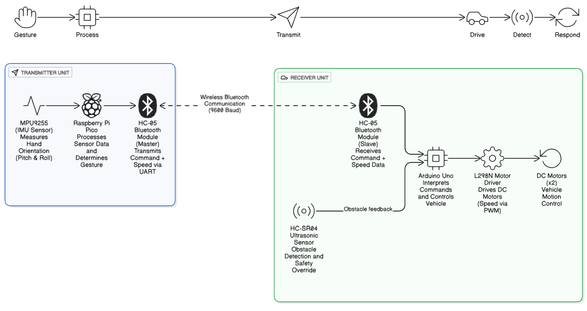
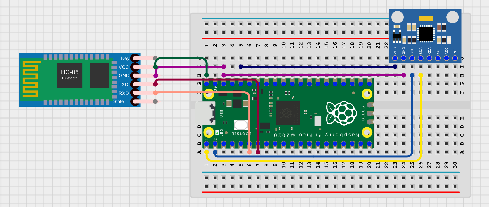
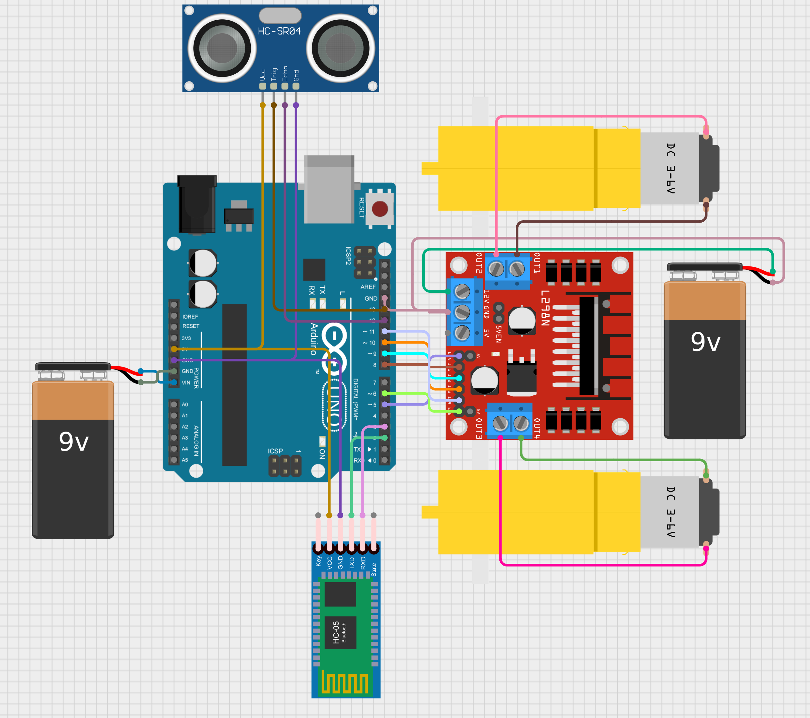
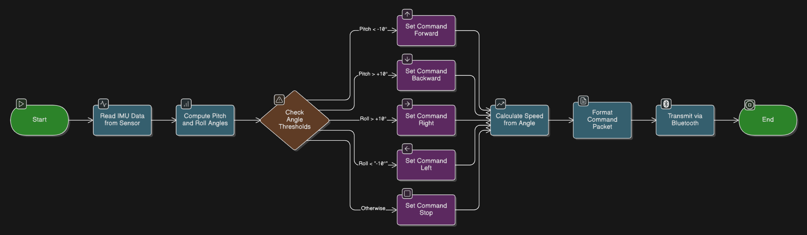
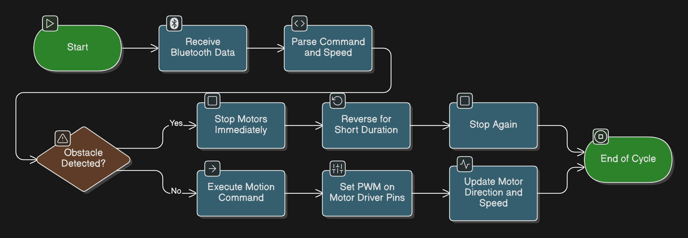
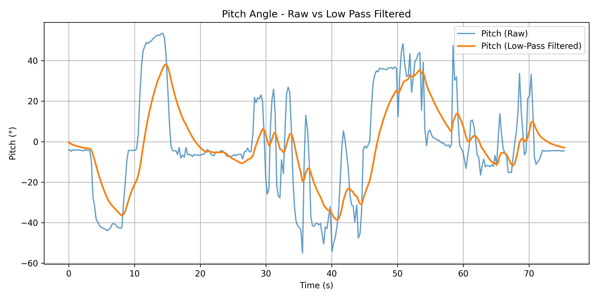
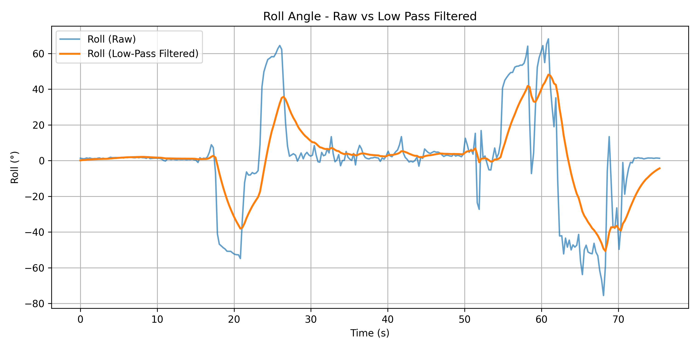
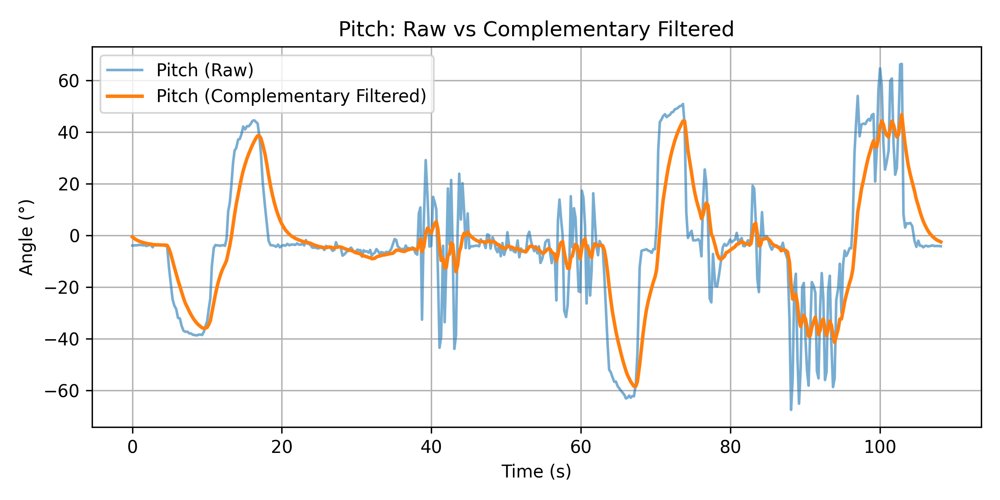
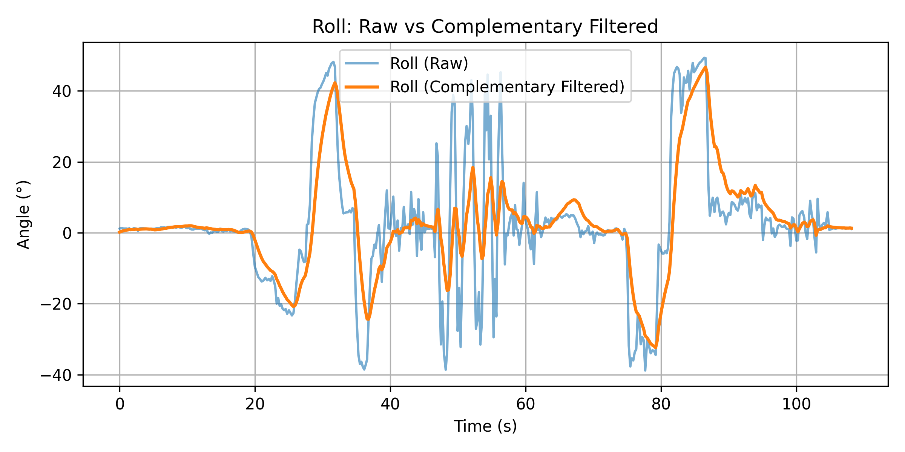
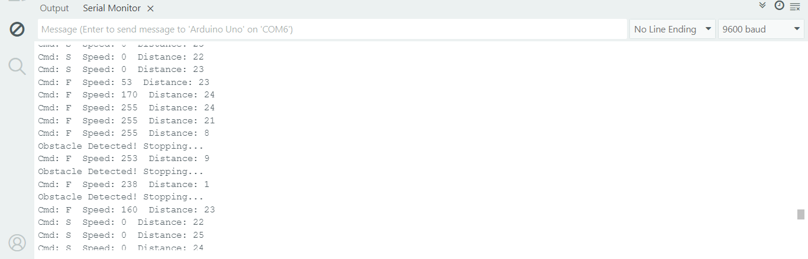

# 🤖 Gesture-Controlled Obstacle-Avoiding Vehicle for Disaster Recovery

A smart **IoT-based robotic rover** that can be controlled through **hand gestures** using motion sensors, while autonomously avoiding obstacles.  
This project integrates **gesture sensing (MPU9255 IMU)**, **Bluetooth communication**, and **real-time obstacle detection (HC-SR04)** into a **low-cost embedded system** for disaster recovery and search-and-rescue scenarios.

---

## 📘 Project Overview

In post-disaster environments, human access is often unsafe or impossible.  
This project demonstrates a **gesture-controlled IoT rover** that can be operated intuitively through hand movements — allowing safe, contactless navigation in hazardous zones.

The system comprises:
- A **Transmitter Unit**: captures hand gestures using an MPU9255 IMU and sends commands via Bluetooth.
- A **Receiver Unit**: receives commands using Arduino Uno and drives motors while detecting and avoiding obstacles using an ultrasonic sensor.

---

## 🧩 System Architecture

The complete architecture integrates sensing, communication, and control units for real-time interaction.

  

---

## ⚙️ Hardware Components

| Component | Description |
|------------|-------------|
| **Raspberry Pi Pico** | Main microcontroller for gesture processing |
| **MPU9255 IMU Sensor** | 9-axis sensor (accelerometer, gyroscope, magnetometer) for motion tracking |
| **HC-05 Bluetooth Module** | Wireless communication between transmitter and receiver |
| **Arduino Uno** | Receiver microcontroller for motion and sensor control |
| **L298N Motor Driver** | Dual H-Bridge for bidirectional motor control |
| **HC-SR04 Ultrasonic Sensor** | Obstacle detection and safety override |
| **DC Motors** | Rear-wheel drive propulsion |
| **Li-ion / 9V Batteries** | Power supply for modules and motors |

---

## 🖼️ Circuit Diagrams

### 🟦 Transmitter Unit

  

<i>Figure: Circuit Diagram of Gesture Controller (Transmitter Unit)</i>

### 🟧 Receiver Unit

  

<i>Figure: Circuit Diagram of Robotic Drive System (Receiver Unit)</i>

---

## 💻 Software Architecture

### Transmitter Logic (Raspberry Pi Pico)
- Reads raw IMU data via I²C.
- Applies **Low-Pass** and **Complementary Filtering** for noise reduction.
- Computes **pitch** and **roll** angles.
- Maps gestures to commands:
  - Pitch < -10° → Forward  
  - Pitch > +10° → Backward  
  - Roll > +10° → Right  
  - Roll < -10° → Left  
  - Otherwise → Stop
- Sends commands via Bluetooth UART (e.g., `F120`, `L080`, `S000`).

### Receiver Logic (Arduino Uno)
- Parses Bluetooth commands.
- Uses PWM to control motor speed.
- Monitors obstacle distance using HC-SR04.
- Halts or reverses if an obstacle is within 15 cm.

  
   <i>Figure: Flowchart of Transmitter Algorithm</i>

  
   <i>Figure: Flowchart of Receiver Obstacle-Avoidance Logic</i>

---

## 🚗 Prototype Implementation

| View | Image |
|------|--------|
| **Prototype (Full Setup)** |  |
| **Front View** |  |
| **Side View** |  |
| **Back View** |  |
| **Gesture Controller - Front View** |  |
| **Gesture Controller - Side View** |  |

---

## 📊 Experimental Results

### 1️⃣ Filtering and Sensor Fusion
The IMU data was processed using:
- **Low-Pass Filter (LPF):** for noise attenuation.
- **Complementary Filter (CF):** for gyro–accelerometer fusion.

| Filter | Noise Reduction | Drift Compensation | Response Lag | Suitability |
|--------|------------------|---------------------|----------------|--------------|
| Low-Pass Filter | High | None | Moderate | Static tracking |
| Complementary Filter | High | Yes | Low | Real-time gesture control |

   
  
   <i>Figure: Pitch and Roll (Raw vs LPF Filtered)</i>

  
  
   <i>Figure: Pitch and Roll (Raw vs Complementary Filtered)</i>

---

### 2️⃣ Obstacle Detection Performance

The ultrasonic sensor reliably detected obstacles up to 2 meters with ±1 cm accuracy.  
When an obstacle appeared within 15 cm, the rover automatically halted and reversed briefly.

  
   <i>Figure: Ultrasonic Obstacle Detection Sequence (Serial Monitor Output)</i>

---

## 🧠 Key Features

- 🎮 **Gesture-Based Control** — Intuitive, contactless human–robot interaction  
- 📶 **Bluetooth Communication** — Low-latency wireless data exchange  
- 🧭 **Sensor Fusion** — Stable, drift-compensated IMU orientation tracking  
- 🚧 **Obstacle Avoidance** — Ultrasonic-based collision prevention  
- 🔋 **Low Power, Modular Design** — Suitable for portable and scalable IoT applications  

---

## 🧰 Setup and Usage

### 🔧 Hardware Connections
1. Connect MPU9255 to Raspberry Pi Pico via I²C (SDA, SCL).
2. Connect HC-05 Bluetooth to Pico UART (TX/RX).
3. Connect receiver HC-05 to Arduino Uno (RX/TX).
4. Interface L298N driver with motor outputs and Arduino PWM pins.
5. Connect HC-SR04 ultrasonic sensor (Trig, Echo) to Arduino digital pins.
6. Power transmitter with 3.7V Li-ion, receiver with dual 9V batteries.

### 💾 Code Upload
1. Open `Transmitter_Code/` in **Thonny** or any MicroPython IDE.  
2. Upload `gesture_tx.py` to **Raspberry Pi Pico**.  
3. Open `Receiver_Code/` in **Arduino IDE** and upload `rover_rx.ino` to **Arduino Uno**.  

### ▶️ Operation
1. Power both units.  
2. Pair Bluetooth modules (HC-05 ↔ HC-05).  
3. Tilt the hand controller to control movement:
   - Forward / Backward / Left / Right.  
4. Observe automatic halt when obstacle is detected.  

---

## 📈 Performance Highlights

| Metric | Result |
|---------|---------|
| Gesture Recognition Delay | < 200 ms |
| Obstacle Detection Response | ~250–300 ms |
| IMU Orientation Stability | ±3° drift over time |
| Bluetooth Range | ~8–10 meters |
| Power Consumption | < 5W total |

---

## 🧾 Future Improvements

- 🌐 **Cloud IoT Integration** for real-time telemetry and monitoring  
- 🤖 **Machine Learning-based Gesture Recognition**  
- 🕹️ **Multi-Agent Coordination (Swarm Mode)**  
- ⚙️ **Kalman / AHRS Filter Implementation** for enhanced accuracy  
- 🔋 **Energy-Optimized Hardware** using ESP32 or BLE Mesh  

## 🪪 License

This project is released under the **MIT License** — feel free to use and modify it for educational or research purposes.
